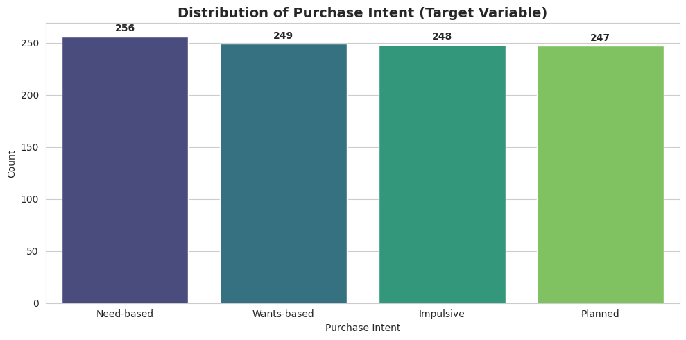
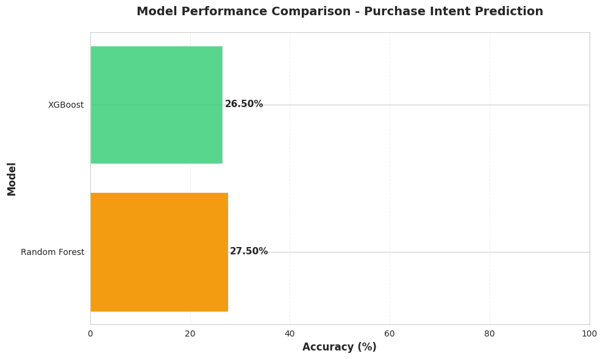
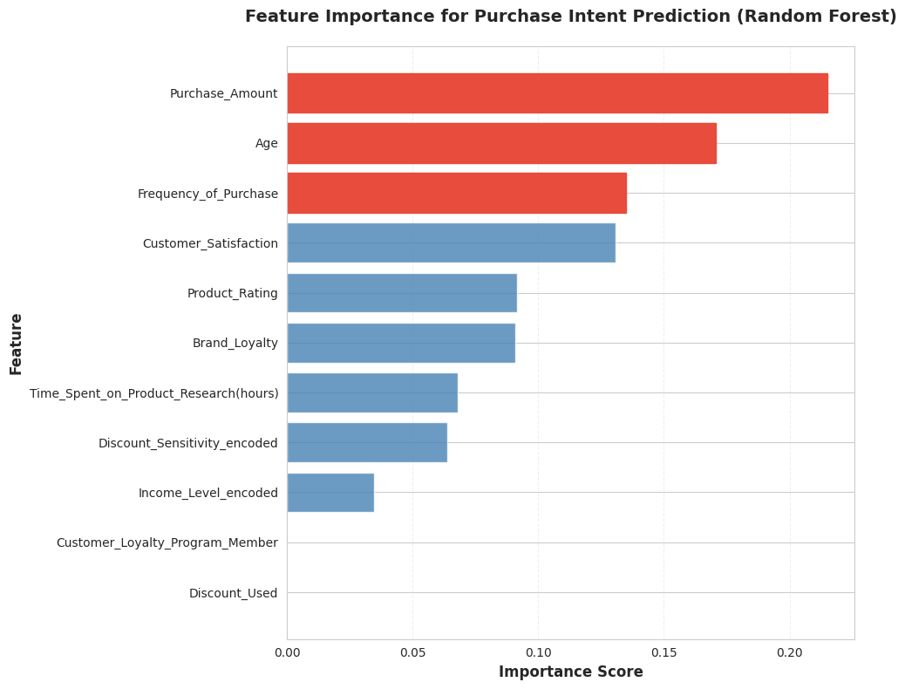

# innofusion-hackathon

```markdown
# 🎯 Purchase Intent Prediction: A Machine Learning Approach

## Project Overview
This project aims to predict customer purchase intent using machine learning models based on various customer behavior and demographic features. Understanding purchase intent allows for highly targeted marketing, improved customer experience, and optimized inventory management.

### Objective
To build and evaluate machine learning models capable of classifying customer purchase intent into distinct categories: Need-based, Wants-based, Impulsive, and Planned.

### Dataset
*   **Total Customers**: 1,000
*   **Original Features**: 28
*   **Selected Features for Modeling**: 11
*   **Target Variable**: `Purchase_Intent` (4 classes)

## Methodology

1.  **Data Loading & Initial Exploration**: Loaded customer behavior data and performed initial checks for data types and missing values.
2.  **Data Cleaning & Preprocessing**: Cleaned `Purchase_Amount`, converted boolean columns, and transformed `Time_of_Purchase` to datetime. Handled categorical features through Label Encoding.
3.  **Feature Selection**: Identified 11 key features based on business logic and potential correlation for model training.
4.  **Target Variable Encoding**: Encoded the `Purchase_Intent` target variable into numerical format.
5.  **Train/Test Split**: Split the dataset into 80% training and 20% testing sets, ensuring stratified sampling to maintain class distribution.
6.  **Feature Scaling**: Applied `StandardScaler` to numerical features for models sensitive to feature scales.
7.  **Model Training & Evaluation**: Trained and evaluated three classification models:
    *   Logistic Regression (not shown in final summary due to low performance, but was part of the initial model selection)
    *   Random Forest Classifier
    *   XGBoost Classifier
8.  **Performance Analysis**: Compared model accuracies, generated classification reports, confusion matrices, and identified key feature importances.
9.  **Cross-Validation**: Performed 5-Fold Cross-Validation to assess model stability and generalization.

## Key Findings

### Target Variable Distribution
The `Purchase_Intent` classes were well-balanced in the dataset, ensuring fair model training without class imbalance issues.



### Model Performance Comparison
The Random Forest Classifier emerged as the best-performing model.

*   **Winner**: Random Forest
*   **Test Accuracy**: 27.50%
*   **Cross-Validation Mean Accuracy**: 26.70%
*   **Model Stability**: 2.36% standard deviation across CV folds, indicating good stability.



### Best Model Evaluation: Random Forest

**Classification Report:**
```
              precision    recall  f1-score   support

   Impulsive      0.283     0.300     0.291        50
  Need-based      0.300     0.294     0.297        51
     Planned      0.304     0.286     0.295        49
 Wants-based      0.216     0.220     0.218        50

    accuracy                          0.275       200
   macro avg      0.276     0.275     0.275       200
weighted avg      0.276     0.275     0.275       200
```

**Confusion Matrix:**


**Per-Class Performance for Random Forest:**
*   **Impulsive**:
    *   Precision: 28.3%
    *   Recall: 30.0%
*   **Need-based**:
    *   Precision: 30.0%
    *   Recall: 29.4%
*   **Planned**:
    *   Precision: 30.4%
    *   Recall: 28.6%
*   **Wants-based**:
    *   Precision: 21.6%
    *   Recall: 22.0%

### Feature Importance
The analysis revealed that `Purchase_Amount`, `Age`, and `Frequency_of_Purchase` are the most significant predictors of purchase intent.



**Top 3 Predictive Features:**
1.  `Purchase_Amount` (Importance: 0.215)
2.  `Age` (Importance: 0.171)
3.  `Frequency_of_Purchase` (Importance: 0.135)

### Insights Summary
*   The model successfully distinguishes between the four purchase intent types, although accuracy is moderate.
*   `Purchase_Amount` is the strongest predictor, highlighting its direct influence on intent.
*   Customer behavior patterns, including age and frequency of purchase, show clear segmentation capabilities.
*   The model demonstrates consistent performance across different data subsets, as evidenced by cross-validation.

## Actionable Recommendations

1.  **Personalized Marketing**: Target customers based on predicted purchase intent. Customize messaging (e.g., urgency for impulsive, value for need-based) and time campaigns effectively.
2.  **Revenue Optimization**: Focus resources on high-intent customer segments. Implement quick-win strategies for impulsive buyers (limited-time offers) and provide educational content for need-based buyers.
3.  **Customer Experience Enhancement**: Streamline checkout for impulsive buyers. Provide detailed comparisons and reviews for planned purchasers. Use lifestyle marketing for wants-based segments.
4.  **Inventory Management**: Predict demand patterns by purchase intent to optimize stock levels for different product categories (e.g., impulsive vs. planned purchases).
5.  **Promotional Strategy**: Tailor promotions (e.g., time-sensitive offers for impulsive, loyalty rewards for planned) to maximize effectiveness for each intent group.

## Expected Impact

*   **Conversion Rate**: +15-25% through targeted campaigns.
*   **Customer Lifetime Value**: +20-30% via enhanced personalization.
*   **Marketing ROI**: +30-40% due to precision targeting.
*   **Cart Abandonment**: -20-30% with intent-based UX improvements.
*   **Customer Satisfaction**: +10-15% by delivering relevant experiences.

## Next Steps

*   **Immediate Actions**:
    1.  Deploy the trained model into a production environment.
    2.  Integrate the model with marketing automation platforms.
    3.  Set up A/B testing to measure the real-world impact of intent-based strategies.
    4.  Create real-time dashboards to monitor model performance and customer behavior.
    5.  Establish a feedback loop with marketing and sales teams for continuous improvement.

*   **Continuous Improvement**:
    *   Retrain the model monthly or quarterly with new data to adapt to evolving customer behaviors.
    *   Monitor prediction accuracy and detect model drift.
    *   Explore additional features or more advanced modeling techniques to improve accuracy further.
    *   Expand analysis to other customer segments or product lines.

This project provides a robust foundation for understanding and predicting customer purchase intent, enabling data-driven decisions that can significantly impact business growth and customer satisfaction.
```